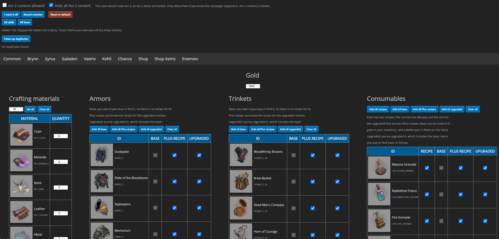

# Descent-LoD-Save-editor-DescentForge
**Descent-LoD-Save-editor-DescentForge** is a tool that allows you to modify save files from the *Descent: Legends of the Dark* app specifically for DescentForge Community.



With this editor you can adjust elements such as:
- character inventory and equipped items  
- skills, abilities, and feats  
- shop inventory
- enemy weaknesses & resistances

👉 **Try it directly online:**  
https://wintechr-alt.github.io/Descent-LoD-Save-editor-DescentForge/

---

## Features
- Full inventory editing  
- Modify character skills and feats  
- Simple and intuitive interface  
- Works entirely locally (no data is sent to any server)

---

## Installation
You can use the editor in two ways:

### 1. **No installation (recommended)**
Use the online version hosted on GitHub Pages:  
https://wintechr-alt.github.io/Descent-LoD-Save-editor-DescentForge

### 2. **Run locally**
Clone the repository:
	```bash
	git clone https://github.com/Wintechr-alt/Descent-LoD-Save-editor-DescentForge
	```
Then open the index.html file in your browser (located in the project root).

---

## How to use
A quick text guide is available here:
https://wintechr-alt.github.io/Descent-LoD-Save-editor-DescentForge/html/instructions.html

---

## Disclaimer
This is an unofficial project and is not affiliated with Fantasy Flight Games.
Use at your own risk: editing save files may cause unexpected behavior in the app.


